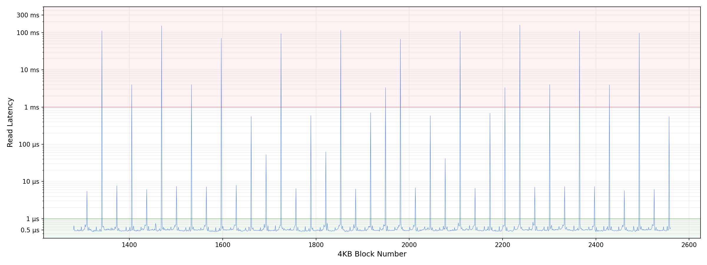

# hydrator

`hydrator` is a command-line tool for pre-warming a file on an EBS volume restored from a snapshot.

## The problem: cold reads after an EBS snapshot restore

A volume created from an EBS snapshot is available for use immediately, but availability does not mean that every block has already been initialized on the new volume. Some snapshot-backed data may still need to be fetched when it is first accessed. As a result, the first read of a block can have much higher latency than a later read of the same block.

AWS explains this behavior in its [documentation on EBS volume initialization](https://docs.aws.amazon.com/ebs/latest/userguide/ebs-initialize.html): snapshot data is initialized lazily, so accessing a block that has not yet been initialized can take longer than accessing it again later.

That latency is especially undesirable during application startup or when a request first reaches data that has not been accessed since the restore. The application then pays the initialization cost on its critical path instead of during a controlled preparation step.

The chart below illustrates this behavior: most reads are fast, but selected 4 KiB block positions show much larger latency (100ms) spikes. The exact latency pattern depends on the snapshot, volume, instance, and workload; the chart is provided to explain the problem rather than as a benchmark for this Java implementation.



## AWS solutions and alternatives

AWS provides several ways to address EBS snapshot initialization:

1. **Manual volume initialization:** read the volume before the application uses it. AWS documents tools such as `dd` and `fio` for reading the volume's data. This is straightforward, but it reads all of the selected data and consumes normal instance and EBS I/O capacity.
2. **Fast Snapshot Restore (FSR):** enable FSR for a snapshot in the Availability Zones where fast access is required. Volumes created from that snapshot are fully initialized at creation time, avoiding the usual first-read initialization penalty. FSR is a managed AWS feature with additional cost and regional/AZ configuration requirements.
3. **Provisioned initialization rate:** where appropriate, use the EBS volume initialization-rate option to request a consistent initialization rate. This is a billed AWS capability and still performs volume initialization rather than selectively sampling application files.

See AWS's [Initialize Amazon EBS volumes](https://docs.aws.amazon.com/ebs/latest/userguide/ebs-initialize.html) documentation for the current initialization methods, pricing details, and limitations. See [Fast Snapshot Restore](https://docs.aws.amazon.com/ebs/latest/userguide/ebs-fast-snapshot-restore.html) for the managed low-latency alternative.

## How this hydrator solution works

`hydrator` is a lightweight, file-focused alternative when fully initializing an entire volume is unnecessary. Instead of reading every byte, it submits one-byte reads at 512 KiB intervals through the file. This targets one offset in each 512 KiB block and moves those selected first-access reads out of the application's path before startup.

The image above explains the motivation: occasional cold offsets can produce latency spikes, so the hydrator touches a representative offset in each larger block rather than performing a full sequential read. The tool uses non-blocking asynchronous reads and replenishes completed reads once per second up to the configured IOPS target.

This approach does not replace FSR or full volume initialization. It is intended for cases where a file or selected application data should be prepared using less read traffic than scanning the entire volume. The appropriate choice depends on the required latency guarantees, data set, AWS costs, and available I/O capacity.

For the exact behavior of this Java implementation, see [What this implementation does](#what-this-implementation-does).

## What this implementation does

- Opens one file read-only.
- Reads one byte from the beginning of every 512 KiB block.
- Uses `AsynchronousFileChannel`, so submitted reads do not block the calling thread.
- Starts up to the configured number of reads and replenishes the deficit every second based on completed reads.
- Defaults to 3,000 target reads per second.
- Reports the number of completed sample reads; it does not report the total file bytes read.

## Usage

```bash
./target/hydrator --help
./target/hydrator --version
./target/hydrator /path/to/file
./target/hydrator --iops 3000 /path/to/file
./target/hydrator --iops=3000 --file /path/to/file
```

Options:

```text
--iops <number>  Target completed reads per second (default: 3000)
--file <path>    File to sample; positional form is also supported
--help           Show usage information
--version        Show the Maven project version
```

## Build a native executable

The native profile uses the installed GraalVM Native Image toolchain and produces `target/hydrator`:

```bash
export JAVA_HOME=/Library/Java/JavaVirtualMachines/graalvm-25.jdk/Contents/Home
export GRAALVM_HOME="$JAVA_HOME"
export PATH="$JAVA_HOME/bin:$PATH"

mvn -B -Pnative clean package -DskipTests
./target/hydrator --version
```

The native executable is platform-specific. The optimized executable built on Apple Silicon is an arm64 Mach-O binary.

## License

This project is released under the MIT License. See [LICENSE](LICENSE).
